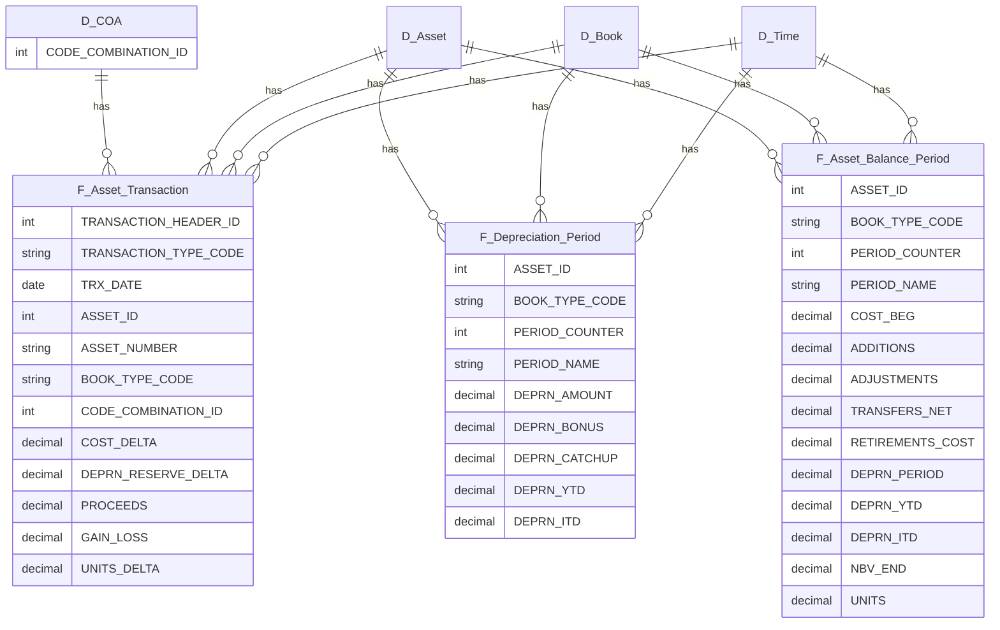

# Fixed Assets Subledger (Oracle Fusion 25C)

[](https://www.oracle.com/webfolder/technetwork/tutorials/tutorial/cloud/r13/wn/ERP/releases/25C/25C-erp-wn.htm)

## Purpose
Subledger-only star schema for Oracle Fusion **Fixed Assets** (25C). Source = BI Publisher (OTBI) → CSV → Power BI today; later pivot to BICC → Fabric with the same column contracts.

- Scope: Fixed Assets subledger only (no SLA).
- COA Join: `CODE_COMBINATION_ID` into governed COA.
- Use Cases: rollforwards, depreciation, additions/retirements, account-level analytics.

## Data Flow
```

Fusion OTBI (BIP Logical SQL) → CSV files → Power BI
Later: Fusion BICC (PVO extracts) → Fabric Lakehouse → same model

```

## Facts & Dimensions
**Facts**
- **F_Asset_Transaction** (header grain; can switch to distribution grain)
  - Keys: TRANSACTION_HEADER_ID, ASSET_ID, BOOK_TYPE_CODE, TRX_DATE, CODE_COMBINATION_ID
  - Measures: COST_DELTA, DEPRN_RESERVE_DELTA, PROCEEDS, GAIN_LOSS, UNITS_DELTA
- **F_Depreciation_Period** (asset×book×period)
  - Keys: ASSET_ID, BOOK_TYPE_CODE, PERIOD_COUNTER
  - Measures: DEPRN_AMOUNT, DEPRN_BONUS, DEPRN_CATCHUP, DEPRN_YTD, DEPRN_ITD
- **F_Asset_Balance_Period** (asset×book×period snapshot)
  - Keys: ASSET_ID, BOOK_TYPE_CODE, PERIOD_COUNTER
  - Measures: COST_BEG, ADDITIONS, ADJUSTMENTS, TRANSFERS_NET, RETIREMENTS_COST, DEPRN_PERIOD, DEPRN_YTD, DEPRN_ITD, NBV_END, UNITS

**Dimensions**: D_Asset (FA_ADDITIONS_B), D_Book (FA_BOOKS), D_Category, D_Location, D_Time (with FA calendar map), **D_COA (PK = CODE_COMBINATION_ID)**.

### Transaction Grain Toggle
This repo ships **both** variants. Pick one for your model:

- **Header grain (default):** `sql/bip/fa_transactions_header.sql`, contract `contracts/fa_transactions.yml`, file `fa_transactions_{yyyymm}.csv`.
  - Pros: fewer rows, fast. Cons: if a single transaction splits across accounts, you lose distribution detail.
- **Distribution grain:** `sql/bip/fa_transactions_distribution.sql`, contract `contracts/fa_transactions_distribution.yml`, file `fa_transactions_distribution_{yyyymm}.csv`.
  - Pros: exact account splits per transaction via `CODE_COMBINATION_ID`. Cons: more rows.
- **Keys:** Header PK = `TRANSACTION_HEADER_ID`. Distribution PK = `[TRANSACTION_HEADER_ID, CODE_COMBINATION_ID]` (plus `DISTRIBUTION_LINE_NUMBER` for traceability).

> In Power BI, use one or the other as `F_Asset_Transaction`. Relationships remain the same (COA by `CODE_COMBINATION_ID`).

## ERD (Mermaid)


%% Note: Additional COA attributes/hierarchies live in your governed model

## Bus Matrix (Kimball)
This repo follows a **bus architecture** with conformed dimensions across facts.  
See **[docs/bus-matrix.md](docs/bus-matrix.md)** for the Fixed Assets matrix and **[docs/bus-matrix-template.md](docs/bus-matrix-template.md)** to extend into other finance domains.

## Contracts-first
Column names/types live in `contracts/*.yml` and are the source of truth. Update contracts → SQL → PBI (in that order). CI validates contracts.

## Getting Started
1) Use `sql/bip/*` in BI Publisher to export CSV partitions.
2) Point `powerbi/queries/*.m` at your CSV folder.
3) Set relationships:  
   - `F_Asset_Transaction[CODE_COMBINATION_ID] → D_COA[CODE_COMBINATION_ID]`  
   - Role-play Time: TRX_DATE vs PERIOD_COUNTER (use `USERELATIONSHIP` in measures).
4) Sanity checks: rollforward math + COA tie-out for a sample month.

## Release Discipline
- Anchored on **25C**. On quarterly updates (25D/26A…), diff What's New, update contracts first.

License: MIT (or org standard).

## References

- **Current Release (25C)**  
  [Oracle Fusion Cloud Applications — What's New 25C](https://www.oracle.com/webfolder/technetwork/tutorials/tutorial/cloud/r13/wn/ERP/releases/25C/25C-erp-wn.htm)  
  [Oracle Help Center — ERP Cloud: Fixed Assets 25C](https://docs.oracle.com/en/cloud/saas/financials/25c/fausi/index.html)

- **Next Release (26A, placeholder)**  
  ⚠️ Link will be live only once Oracle posts 26A.  
  [Oracle Fusion Cloud Applications — What's New 26A](https://www.oracle.com/webfolder/technetwork/tutorials/tutorial/cloud/r13/wn/ERP/releases/26A/26A-erp-wn.htm)  
  [Oracle Help Center — ERP Cloud: Fixed Assets 26A](https://docs.oracle.com/en/cloud/saas/financials/26a/fausi/index.html)

- **General References**  
  - [BI Publisher Reports for Financials (25C)](https://docs.oracle.com/en/cloud/saas/financials/25c/faugl/bip-reports.html)

*Tip: The "Next Release" links are pre-baked placeholders. They will 404 until Oracle publishes the docs — update or uncomment as needed once live.*